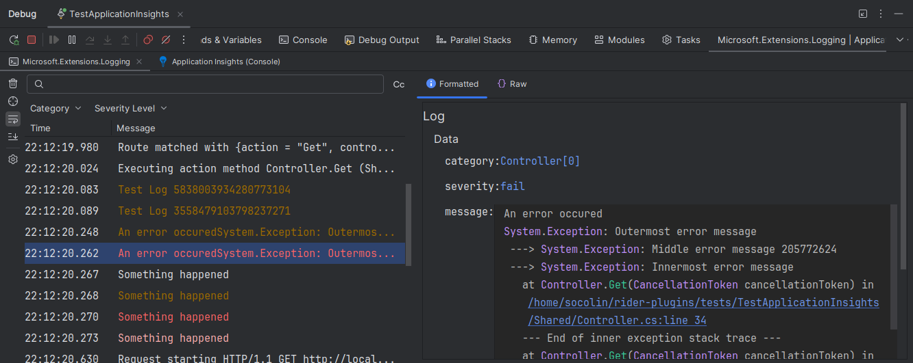
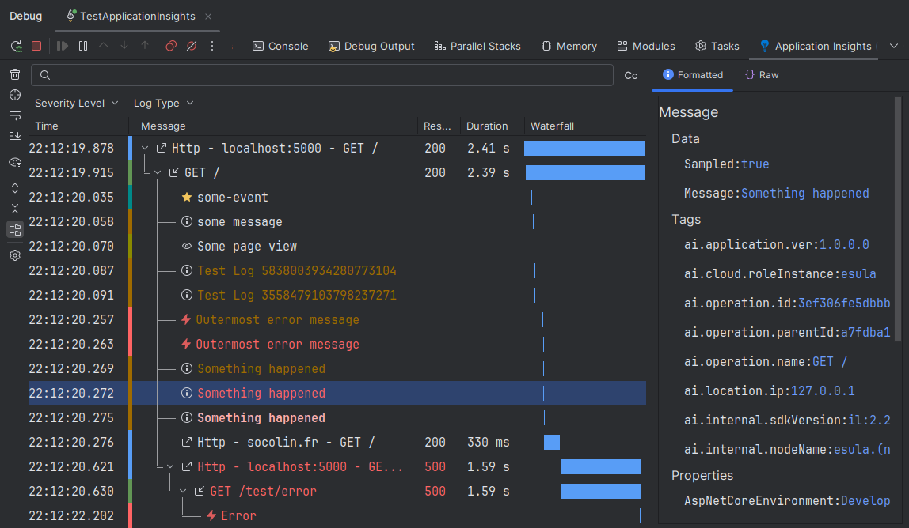

# Awesome Log Viewer

    

A versatile log viewer plugin that allows you to view logs in a much nicer way.
It also allows you to see the telemetry from Application Insights or Open Telemetry.

    

## Features

- Real-time log monitoring and visualization
- Log filtering system
- Automatically capture logs when using run/debug
- Support for multiple log sources
    - Application Insights
    - OpenTelemetry
    - Console output, like Microsoft.Extensions.Logging or NLog and even custom logs
- Configure environment variables to control log output (Only for .NET and Java Run Configuration)

## Premium Features

- Structured / Hierarchical views
- Waterfall view

    

## License

See the [LICENSE.MD](LICENSE.MD) file for details.
