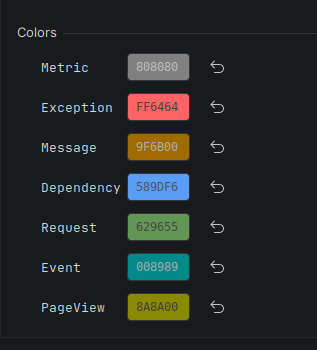

# Application Insights module

This module captures **Azure Application Insights** telemetry emitted by your application
and displays it in the log view. It is most useful for .NET projects but works with any
runtime that can send Application Insights telemetry.

Settings live under **Settings / Preferences → Tools → Awesome Log Viewer → Application
Insights**.

## Telemetry it understands

The module recognizes the standard Application Insights telemetry types and renders each one
appropriately:

| Type | Shown as |
| --- | --- |
| **Message** | A log message, colored by severity. |
| **Request** | An incoming request with its name and HTTP result code. |
| **Remote dependency** | An outbound call (HTTP, SQL, …) with its target, name, and result code. |
| **Exception** | The exception message, with the full stack trace in the detail panel. |
| **Metric** | The metric name(s) and value(s). |
| **Event** | A custom event name. |
| **Page view** | A page/view navigation name. |

Requests and dependencies are colored by outcome (success / client error / server error) and
expose a **Duration** so you can spot slow calls. Selecting any entry shows its full set of
fields (ids, URL, result code, custom properties, inner exceptions, …) in the **Formatted**
tab and the raw payload in the **Raw** tab.

## How to capture telemetry

Two processors are available; pick whichever fits your project. Each can be enabled
independently for Run and for Debug.

### Network (recommended)

> *"The Network Log Processor starts an http server to catch the logs. Logs can be redirected
> to this by setting the environment: `APPLICATIONINSIGHTS_CONNECTION_STRING`."*

The plugin starts a small HTTP server that speaks the Application Insights ingestion
protocol, then points your app at it by setting `APPLICATIONINSIGHTS_CONNECTION_STRING`.

For **.NET and Java run configurations the environment variable is injected automatically.**
The defaults are:

```
APPLICATIONINSIGHTS_CONNECTION_STRING=InstrumentationKey=${INSTRUMENTATION_KEY};IngestionEndpoint=http://localhost:${SERVER_PORT}/
APPINSIGHTS_DEVELOPER_MODE=true
```

- `${SERVER_PORT}` is replaced at startup with the port the plugin chose.
- `APPINSIGHTS_DEVELOPER_MODE=true` makes the SDK send telemetry immediately instead of
  batching it, so entries appear without delay.

For any other run configuration, set a fixed port under **Configuration** and add the
connection string to your run configuration yourself.

### Console

> *"The Console Log Processor parses logs from the Debug output when debugging .NET projects
> to extract telemetry data. This allows catching all logs and simplifying debugging of
> sampling configurations."*

The console processor reads telemetry that the Application Insights SDK writes to the Debug
output while debugging a .NET project — no HTTP server, no environment variables. For
non-.NET projects you can write telemetry as JSON to the console (as the .NET
`TelemetryDebugWriter` does) and parse it with this processor.

## Settings

The Application Insights page exposes the [shared per-source settings](overview.md#shared-per-source-settings)
(Activation, Output Source / Configuration, Environment Variables) plus:

### Colors

A color can be assigned to each telemetry type so they stand out in the table:



## Forwarding to Azure (or another collector)

With **Forward logs (Experimental)** enabled, if a real
`APPLICATIONINSIGHTS_CONNECTION_STRING` is configured the captured telemetry is forwarded to
that endpoint as well — so you can watch it locally in the plugin *and* still have it land in
Azure Application Insights (or another collector).
