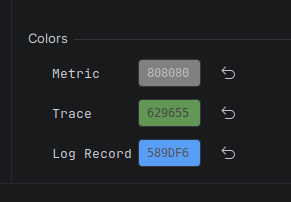

# OpenTelemetry module

This module captures **OpenTelemetry (OTLP)** signals emitted by your application and
displays them in the log view.

Settings live under **Settings / Preferences → Tools → Awesome Log Viewer → Open
Telemetry**.

## Signals it understands

OpenTelemetry defines three signal types, all supported by this module:

| Signal | Shown as |
| --- | --- |
| **Trace** | A span. Server spans (incoming requests), client spans (outbound calls), and internal spans are distinguished by icon and message, with HTTP method/route, target, status, and **Duration**. |
| **Metric** | A metric record with its name and value. |
| **Log** | A log record, colored by severity. |

Selecting a trace shows its full detail in the **Formatted** tab — trace id, span id,
duration, name, span events, links, the resource (service name/version/host), and all
attributes — while the **Raw** tab shows the original payload. Spans whose status is *Error*
are highlighted, and HTTP status codes appear in the **Result** column.

## How to capture signals

Two processors are available; pick whichever fits your project. Each can be enabled
independently for Run and for Debug.

### Network (recommended)

The Network Log Processor starts an http server to catch the logs. Logs can be redirected
to this by setting the environment: `OTEL_EXPORTER_OTLP_ENDPOINT`

For **.NET and Java run configurations the variables are injected automatically.** The
defaults are:

```
OTEL_EXPORTER_OTLP_ENDPOINT=http://localhost:${SERVER_PORT}/
OTEL_EXPORTER_OTLP_METRICS_ENDPOINT=http://localhost:${SERVER_PORT}/v1/metrics
OTEL_EXPORTER_OTLP_TRACES_ENDPOINT=http://localhost:${SERVER_PORT}/v1/traces
OTEL_EXPORTER_OTLP_LOGS_ENDPOINT=http://localhost:${SERVER_PORT}/v1/logs
OTEL_EXPORTER_OTLP_PROTOCOL=http/protobuf
OTEL_METRIC_EXPORT_INTERVAL=10000
```

- `${SERVER_PORT}` is replaced at startup with the port the plugin chose.
- The protocol is `http/protobuf`; `OTEL_METRIC_EXPORT_INTERVAL=10000` exports metrics every
  10 seconds so they show up quickly.

For any other run configuration, set a fixed port under **Configuration** and add the
variables to your run configuration yourself. See the
[OTLP exporter configuration docs](https://opentelemetry.io/docs/languages/sdk-configuration/otlp-exporter/)
for the full list of variables.

### Console

The ConsoleExporter is not designed to be machine-readable, so the result is not optimal.
If you can use the Network Log Processor instead, you'll get the best result with it.

The console processor parses the output of the .NET `ConsoleExporter`. It works without any
HTTP server, but because that exporter's output is meant for humans rather than machines the
result is less complete than the Network processor — prefer Network when you can.

## Settings

The Open Telemetry page exposes the [shared per-source settings](overview.md#shared-per-source-settings)
(Activation, Configuration, Environment Variables) plus:

### Colors

A color can be assigned to each signal type (Trace, Metric, Log) so they stand out in the
table.



## Forwarding to a collector (e.g. Aspire Dashboard)

With **Forward logs (Experimental)** enabled, if `OTEL_EXPORTER_OTLP_ENDPOINT` is already set
to a real collector the captured signals are forwarded there as well. This lets the plugin
sit in front of an existing OTLP destination — such as the **.NET Aspire Dashboard** or the
OpenTelemetry plugin in Rider — so you see the data locally *and* it still reaches your
collector.
