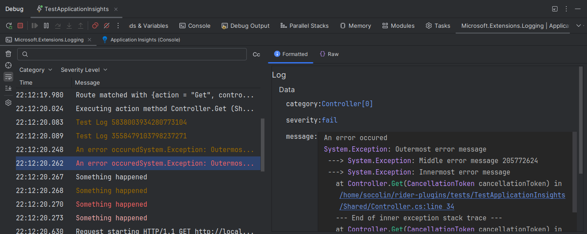
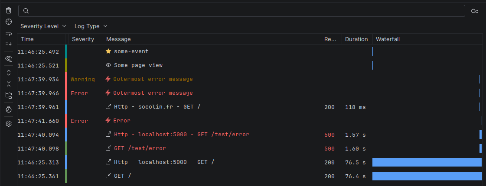
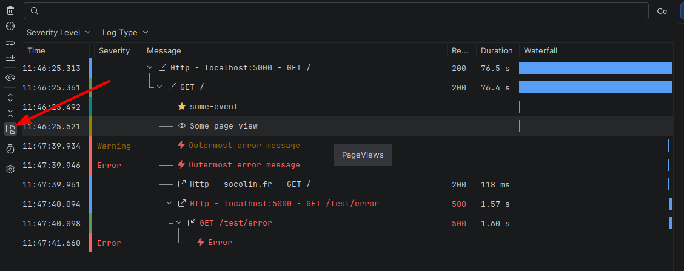
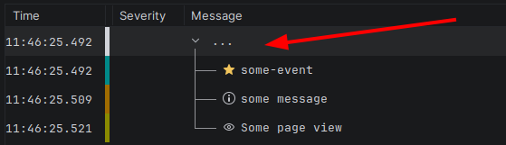
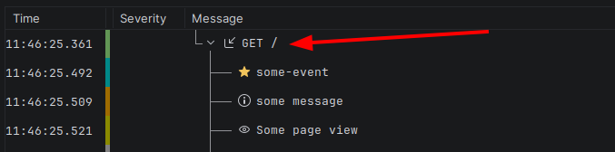
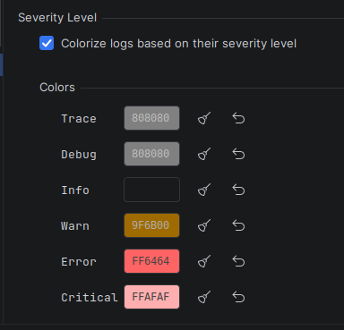
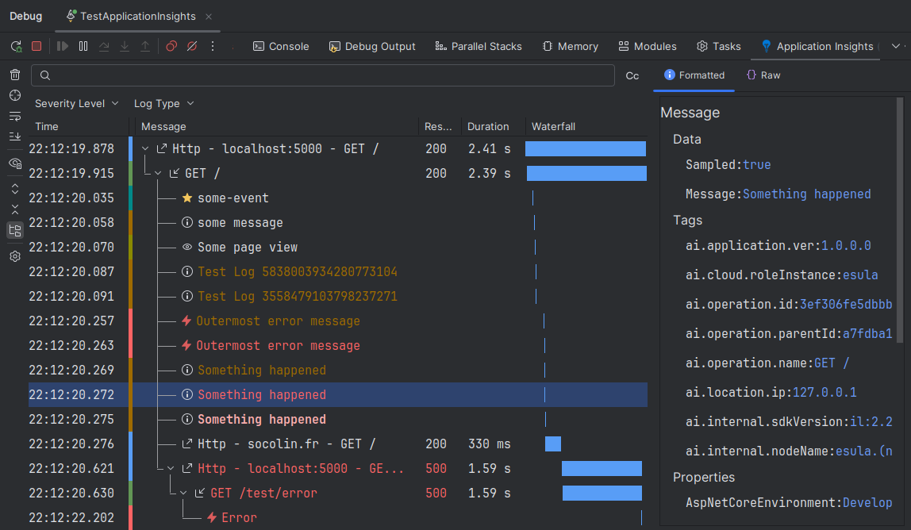

# Overview & General Settings

## What the plugin does

Awesome Log Viewer turns the raw text your application writes to the console (or the
telemetry it sends to Application Insights / OpenTelemetry) into a structured, searchable,
color-coded table inside your IDE.

Its main capabilities are:

- **Real-time log monitoring and visualization** — entries appear as your application runs.
- **Automatic capture on Run / Debug** — there is no separate "start logging" step; the
  plugin hooks into your existing run and debug configurations.
- **Multiple log sources** — console output (Serilog, Microsoft.Extensions.Logging, NLog,
  or a custom format), Azure **Application Insights**, and **OpenTelemetry**. Each source is
  handled by a dedicated *module* (described on its own page).
- **Filtering** — full-text search plus per-property filters that populate themselves from
  the data you receive.
- **Environment-variable injection** — for .NET and Java run configurations, the plugin can
  automatically set the environment variables your app needs to send its telemetry to the
  plugin (no run-configuration edits required).

## Where the logs appear

When you Run or Debug a configuration, the plugin adds a **tab inside the Run/Debug tool
window** for each enabled log source. The tab is named after the source (for example
*Open Telemetry*, *Application Insights*, or your custom console processor) and carries that
source's icon.

> The plugin does not open its own separate tool window — it lives next to the standard
> *Console* tab of the run that produced the logs.

## The log view

Each log tab is split into three resizable areas:

| Area | Purpose |
| --- | --- |
| **Toolbar** (left) | Actions for the current log list (see below). |
| **Filter bar** (top) | Search field and the per-property filter buttons. |
| **Log table** (middle) | One row per captured log entry. |
| **Detail panel** (bottom) | Full content of the selected row, in a *Formatted* and a *Raw* tab. |

### Columns

The table shows, depending on the source and your column choices:

- **Time** — timestamp (`HH:mm:ss:SSS`); click the header to sort.
- A thin **color bar** reflecting the entry's severity.
- **Severity** — Trace, Debug, Info, Warn, Error, or Critical.
- **Message** — the main text of the entry.
- **Result** — a status/result code (e.g. an HTTP status).
- **Duration** — how long the operation took (sortable; mainly for traces/requests).
- **Waterfall** — timeline visualization *(premium, hidden without a license)*.

Right-click the table header to show or hide columns. Your choice is remembered per source.

### Severity & colors

Entries are classified into six severity levels, each with a default color you can change in
the settings (see below):

| Level | Default color |
| --- | --- |
| Trace | Gray |
| Debug | Gray |
| Info | *(none)* |
| Warn | Orange |
| Error | Red |
| Critical | Pink |

### The detail panel

Selecting a row shows its full content in two tabs:

- **Formatted** — the entry's fields laid out in a readable, structured form.
- **Raw** — the original payload with syntax highlighting and code folding.

## Toolbar actions

| Action | Description |
| --- | --- |
| **Clear** | Clears all logs from the view. |
| **Locate Selected Log** | Scrolls to the selected log. |
| **Soft Wrap** | Wraps long lines onto multiple lines. |
| **Scroll To End** | Automatically scrolls to the newest entry as logs arrive. |
| **Show Time From Start** | Shows each entry's time relative to the start of the program. |
| **Show Sampling Filter** | Marks logs that were sampled and not sent to the server (only for sources that support sampling). |
| **Structured View Mode** | Toggles between the flat list and the hierarchical tree *(premium)*. |
| **Expand All / Collapse All** | Expands or collapses the tree in structured mode *(premium)*. |
| **Open Settings** | Opens the plugin's settings page. |

## Filtering

- **Text search** — type in the filter bar to match entries in real time. A *match case*
  toggle controls case sensitivity.
- **Property filters** — each source exposes a set of properties (severity, category, signal
  type, or any field you map yourself). They appear as buttons that fill up with the values
  actually seen in the data; click one to pick which values to show, with **Select All** /
  **Deselect All** shortcuts.

Your filter selections are remembered per source.

## General settings

Open **Settings / Preferences → Tools → Awesome Log Viewer**. These settings are stored per
project. Each module (Application Insights, Open Telemetry, Simple Console) has its own
sub-page underneath this one.

### Logs

- **Max log count** — maximum number of entries kept in memory (0 – 1,000,000; default
  10,000). Older entries are dropped once the limit is reached.
- **Show timestamp from the start of the program** — display times relative to program start
  rather than wall-clock time.
- **Line height** — height in pixels of each table row (12 – 100; default 32).

### Structured Logs *(premium)*

**What the structured (hierarchical) view is.** Logs often have parent/child relationships:
an incoming request triggers several outbound dependency calls and log messages; a span has
child spans; a custom log entry references the entry that produced it. In the normal **flat**
view these all appear as separate rows in arrival order. The **structured view** instead
nests each entry under its parent as a collapsible **tree**, so you can see at a glance which
logs belong to which operation, follow causality, and collapse the parts you don't care
about to cut noise. Toggle it from the toolbar's **Structured View Mode** button.

It applies to **every source** that exposes parent/child links — Application Insights
(requests and their dependencies), OpenTelemetry (parent/child spans), and the custom Console
module (entries with `id` / `parentId`).

Here an example of the difference between the classic view and the structured view:

- **Create Fake Parent Node** — *"When using Structured Log View, if a dependency is received
  before the parent, a fake node will be created until the parent log is found."* Children
  sometimes arrive before their parent (the parent operation finishes, and is reported, after
  the work it spawned). When that happens this option inserts a temporary placeholder parent
  so the child still nests correctly; the placeholder is replaced once the real parent
  arrives.

### Severity Level

- **Colorize logs based on their severity level** — turn severity coloring on or off.
- **Colors** — when coloring is on, a color picker is shown for each level (Trace, Debug,
  Info, Warn, Error, Critical). Each level has:
  - **Remove Color** — leave that level uncolored.
  - **Reset Color** — restore the default color.

## Shared per-source settings

Every source's sub-page shares the same building blocks:

- **Activation**
  - **Enable when running**: Whether to enable the source when the program is running.
  - **Enable when debugging**: Whether to enable the source when the program is being debugged.
- **Output Source** *(console-based sources)*
  - **Standard output / error** — parse stdout/stderr *(requires changes in your code)*.
  - **Debug** — parse the Debug output stream *(default on)*.
- **Configuration** *(network-based sources — Application Insights & OpenTelemetry)*
  - **Use random port** — let the plugin pick a free port (default), or specify a fixed one
    (range 1 – 65536).
  - **Forward logs (Experimental)** — *"If another endpoint is configured, the logs will be
    forwarded to it."* Lets the captured telemetry continue on to a collector you already
    configured (for example the .NET Aspire Dashboard). Enabled by default.
- **Environment Variables** — variables injected when the program starts. *For Java and .NET
  run configurations only.* The string `${SERVER_PORT}` is replaced with the port the
  plugin's HTTP server is listening on. For other run configurations, use a fixed port and
  add the variables to your run configuration yourself.

## Premium features

A license unlocks:

- **Structured / Hierarchical views** — render parent/child relationships as a tree, with
  expand/collapse and the *Create Fake Parent Node* behavior above.
- **Waterfall view** — a timeline column showing how entries overlap in time.

